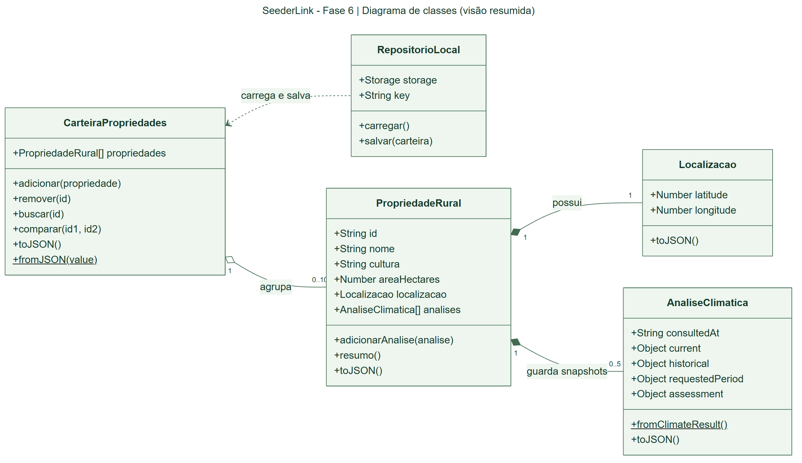

# SeederLink · Fase 6

**Carteira de Propriedades: cadastre, guarde o histórico climático e compare duas propriedades.**

Projeto acadêmico FIAP desenvolvido a partir do ZIP da Fase 5. Toda a interface continua em React. A nova função organiza e compara resultados climáticos em uma carteira persistida no navegador.

- [Site no GitHub Pages](https://dansfisica85.github.io/site_seederlink-wolvestech/)
- [Repositório](https://github.com/dansfisica85/site_seederlink-wolvestech)
- [Diagrama UML em imagem](public/docs/diagrama-classes-fase6.png)
- [Roteiro do pitch de até 3 minutos](docs/ROTEIRO_PITCH_FASE_6.md)
- **Pitch da Fase 6:** aguardando novo vídeo público. O vídeo da Fase 5 não o substitui.

> Demonstração acadêmica: a triagem não concede crédito real nem determina aptidão agrícola. A carteira usa `localStorage`, sem conta, servidor ou sincronização entre dispositivos. O formulário de contato herdado valida e exibe confirmação visual, mas não envia e-mail.

## Integrantes

| Nome completo | RM |
| --- | --- |
| DAVI ANTONINO NUNES DA SILVA | 571722 |
| MATEUS AUGUSTO DA COSTA OLIVEIRA GONÇALVES | 570166 |
| JOHN NICHOLAS FIALHO SILVA | 572119 |
| MATHEUS RISSATO CRISPIM | 571038 |
| ISAAC NILTON ALVARENGA DA SILVA | 573766 |

## O que mudou, passo a passo

| Fase 5, preservada | Novidade da Fase 6 |
| --- | --- |
| Mapa no Fale Conosco e consulta pontual | Botão para enviar uma fotografia da consulta à carteira |
| Resultado apenas da consulta em andamento | Cadastro salvo com nome, cultura, área e coordenadas |
| Uma análise por vez | Até 10 propriedades e 5 consultas recentes por propriedade |
| Sem comparação de cadastros | Tabela lado a lado de duas propriedades |
| Sem classes de carteira | Cinco classes reais de domínio e UML correspondente |
| Documentação da Fase 5 | Comparação entre fases, roteiro, diagrama e instruções da Fase 6 |

Também ajustei a chave do cache climático para preservar a coordenada exata: pontos próximos, mas diferentes, não compartilham mais a mesma consulta.

O README original está em [docs/README_FASE5_REFERENCIA.md](docs/README_FASE5_REFERENCIA.md). A comparação detalhada está em [docs/COMPARACAO_FASE5_FASE6.md](docs/COMPARACAO_FASE5_FASE6.md). `js/script.js` e `css/styles.css` são apenas referências históricas, não carregadas pelo site.

## Executar localmente

Instale Node.js 22 LTS ou superior, abra a pasta no VS Code e execute:

```bash
npm ci
npm test
npm run dev
```

Abra o endereço informado pelo Vite, normalmente `http://localhost:3000`. Para conferir a produção:

```bash
npm run build
npm run preview
```

Não abra `index.html` por duplo clique: JSX precisa do Vite. Não há token climático nem banco remoto para configurar. Internet é necessária para mapa, fontes e novas consultas. Os registros salvos podem ser lidos sem consultar o clima, desde que a aplicação tenha sido carregada; não há PWA com carregamento offline garantido.

## Usar a carteira

1. No **Fale Conosco**, clique no mapa, arraste o marcador, digite latitude/longitude ou autorize a localização do navegador.
2. Aguarde o resultado. Enquanto houver carregamento ou erro, não aparece a ação de salvar aquela consulta.
3. Clique em **Salvar esta análise na carteira**. O foco vai para a seção **Propriedades**.
4. Confira coordenadas, fonte e período; preencha nome, cultura (soja/tomate) e área em hectares. Vírgula decimal é aceita.
5. Clique em **Salvar propriedade**. O registro permanece após recarregar a página.
6. Cadastre outra propriedade; marque duas opções **Comparar** e clique em **Comparar selecionadas**.
7. Confira cultura, área, coordenadas, médias, período, dias válidos, fonte, captura e triagem. Fontes ou períodos diferentes geram um aviso, não um ranking.
8. Para atualizar um histórico, consulte a mesma coordenada e escolha **Atualizar histórico** no destino. A sexta consulta substitui a mais antiga.
9. **Exportar JSON** baixa uma cópia legível. A versão atual não tem importação automática. A remoção pede confirmação e preserva os demais cadastros.

**Privacidade:** os dados ficam neste navegador e nesta origem. Limpar os dados do navegador remove a carteira; evite dispositivos compartilhados. `localhost`, GitHub Pages e outros domínios têm carteiras separadas. A carteira não envia registros a servidor próprio, mas as consultas climáticas enviam coordenadas às APIs e o mapa carrega tiles externos.

## Onde está cada parte do código

| Arquivo | Responsabilidade |
| --- | --- |
| `src/main.jsx` | Monta a aplicação React e importa o CSS global. |
| `src/App.jsx` | Organiza as seções e compartilha a análise escolhida entre mapa e carteira. |
| `src/components/Contato.jsx` | Preserva informações, formulário e mapa da Fase 5. |
| `src/components/MapaClimatico.jsx` | Cria Leaflet, mantém marcador/estado e envia uma cópia do resultado à carteira. |
| `src/lib/climate.js` | Consulta APIs, calcula médias, cruza critérios e gerencia cache/cancelamento. |
| `src/components/CarteiraPropriedades.jsx` | Formulário, cartões, histórico, comparação, exportação e mensagens acessíveis. |
| `src/domain/portfolio.js` | Cinco classes UML, validação e persistência, independentes do React. |
| `src/styles/portfolio.css` | Estilos responsivos isolados da nova seção. |
| `src/data/entrega.js` | Campo `pitchUrl` e links da entrega. |
| `docs/DIAGRAMA_CLASSES.mmd` | Fonte editável do UML. |
| `tests/portfolio.test.js` | Testes das classes, limites e persistência. |
| `scripts/verify-ui.mjs` | Teste do fluxo completo em navegador com clima controlado. |

### Como o React participa

Todas as seções ativas são componentes React. A carteira usa `useState` para cadastro, lista, mensagens e comparação; `useEffect` para foco/eventos entre abas; `useRef` para título e versão salva. Não há página HTML paralela para a Fase 6.

`MapaClimatico` guarda `result`. O clique em salvar cria uma cópia com `structuredClone` e registra a data da captura. `App` passa a fotografia à carteira. O formulário constrói `AnaliseClimatica`, `Localizacao` e `PropriedadeRural`, adiciona à `CarteiraPropriedades` e chama `RepositorioLocal.salvar`. **A tela só atualiza depois da gravação bem-sucedida.**

Os métodos retornam novas instâncias, preservando o estado anterior se a gravação falhar. Trocar o marcador depois não muda um registro salvo. Acesso bloqueado, cota cheia, JSON corrompido e alterações em outra aba geram mensagens, sem apagar dados silenciosamente.

### Origem e cruzamento do clima

O [Leaflet](https://leafletjs.com/) exibe a cartografia [OpenStreetMap](https://www.openstreetmap.org/copyright). A [Open-Meteo Forecast API](https://open-meteo.com/en/docs) fornece condições atuais; a [Historical Weather API](https://open-meteo.com/en/docs/historical-weather-api) fornece o histórico principal. A [NASA POWER](https://power.larc.nasa.gov/) é a alternativa histórica.

A janela solicita 365 dias, termina sete dias antes da consulta e exige ao menos 350 dias com as três métricas completas. Temperatura usa °C; umidade, %. A radiação atual usa **W/m²**, enquanto a média histórica diária usa **MJ/m²/dia**.

`evaluateClimateSuitability`, em `src/lib/climate.js`, exige simultaneamente temperatura média de **20 a 27 °C**, umidade média de **60% a 80%** e radiação média **a partir de 8,5 MJ/m²/dia**. São faixas demonstrativas herdadas, não um modelo financeiro/agronômico validado. Cultura e área são dados cadastrais e não mudam a regra. O mapa escolhe um ponto; não mede a área nem analisa o solo.

Se a NASA POWER for usada, os indicadores são mostrados, mas a pré-aprovação automática permanece bloqueada. `AnaliseClimatica` valida números e refaz a regra ao reabrir o JSON, sem confiar em um campo `suitable` isolado.

## UML: classes reais



Modelado com [Mermaid](https://mermaid.js.org/syntax/classDiagram.html) e exportado com [Mermaid CLI](https://github.com/mermaid-js/mermaid-cli). O arquivo `.mmd` pode ser editado no Mermaid Live Editor ou em extensão compatível do VS Code.

O diagrama agora usa **paisagem**, com três colunas, relações sem cruzamentos e uma visão resumida dos atributos e métodos principais. A página do UML no PDF também fica em paisagem; as demais continuam em retrato. A [versão SVG](public/docs/diagrama-classes-fase6.svg) permite ampliar sem perder nitidez.

Para manter a leitura clara, os tipos de retorno e parte dos parâmetros foram abreviados. `fromClimateResult` recebe `result` e `consultedAt`; `buscar` e `resumo` podem retornar `null`. Os detalhes completos permanecem em `src/domain/portfolio.js`. Os losangos representam pertencimento conceitual; as versões imutáveis podem compartilhar instâncias no código.

- `Localizacao`: latitude/longitude; valida no construtor e serializa com `toJSON`.
- `AnaliseClimatica`: condições atuais, histórico, período, fonte, avaliação e data; `fromClimateResult` cria o snapshot validado.
- `PropriedadeRural`: id, nome, cultura, área, localização e análises; `adicionarAnalise` controla histórico e `resumo` retorna a análise mais recente.
- `CarteiraPropriedades`: adiciona, remove, busca e compara; `fromJSON` reconstrói registros.
- `RepositorioLocal`: recebe `storage`/`key` e isola `carregar`/`salvar` no navegador.

**Relacionamentos:** losango vazio = agregação da carteira com 0..10 propriedades; losango preenchido = composição da propriedade com 1 localização e 0..5 análises; seta tracejada = dependência do repositório em relação à carteira. Não foi inventada herança. O domínio permite zero análises, mas a tela só cadastra a partir de consulta concluída. `+` indica membro público; métodos estáticos estão sublinhados. Componentes React são funções, não subclasses dessas entidades.

## Testes

```bash
npm test
npm run build
```

Cobertura: faixas climáticas, NASA, cache exato, validações, reconstrução, imutabilidade, dez propriedades, cinco análises, comparação, corrupção, permissão e cota.

Para testar a interface, execute `npm run dev -- --port 4176 --open false` em um terminal e, em outro:

```bash
npx playwright install chromium
npm run test:ui
```

Opcionalmente configure `TEST_URL` para outro endereço e `CHROME_PATH` para um Chrome já instalado. O teste usa contexto separado e clima controlado; verifica salvar, recarregar, comparar, histórico, NASA, exportar, remover, 360/768/1440 px, cota e corrupção. Isso não prova disponibilidade das APIs reais. Capturas ficam em `test-results/`, fora do Git e do pacote.

## Deploy

O provedor permanece GitHub Pages, como na Fase 5. Em Settings > Pages, a origem deve ser GitHub Actions. O workflow `.github/workflows/deploy-pages.yml` instala dependências, executa testes e build e publica a `main`, usando `VITE_BASE_PATH=/site_seederlink-wolvestech/`. Pull requests são testados sem publicar.

Após enviar uma alteração, aguarde `build` e `deploy` concluírem e confira o site, a carteira e o diagrama em janela anônima. Para outro provedor, publique `dist` após `npm run build` e ajuste `VITE_BASE_PATH`. Nunca envie `.env`, credenciais ou `node_modules`.

## Pitch e pacote

O novo vídeo deve apresentar **a carteira e o UML**, durar até três minutos e estar **público**. O [roteiro](docs/ROTEIRO_PITCH_FASE_6.md) já inclui sequência de telas. Depois da publicação:

1. Preencha `pitchUrl` em `src/data/entrega.js` com a URL pública da Fase 6.
2. Inclua o mesmo link no PDF. Não use o vídeo da Fase 5 como se fosse novo.
3. Refaça o deploy e os ZIPs e teste os links sem autenticação.

```text
RM571722_DaviANS_FASE_6_SPRINT6.zip
├── Seederlink_fase6.pdf
└── 01_Projeto_SeederLink_Fase6.zip
    └── site_seederlink-wolvestech/
        ├── src/
        ├── public/docs/diagrama-classes-fase6.png
        ├── docs/
        ├── tests/
        ├── scripts/
        ├── package.json
        ├── package-lock.json
        └── README.md
```

O PDF reúne integrantes, RMs, imagem UML e links de deploy e vídeo. **Enquanto o link do novo pitch não for fornecido, o PDF é uma versão de revisão e o pacote não está pronto para postagem final na FIAP.** Não inclua arquivos MP4 nem outro formato de vídeo no pacote.
